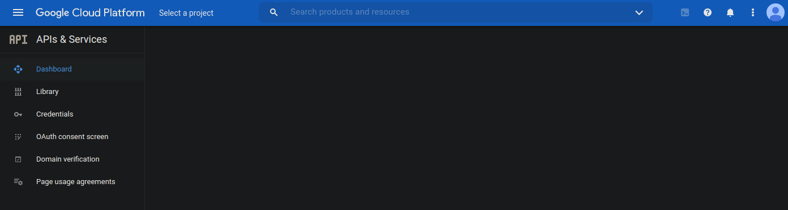
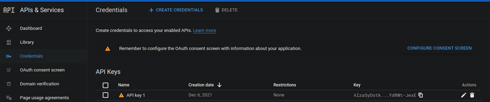
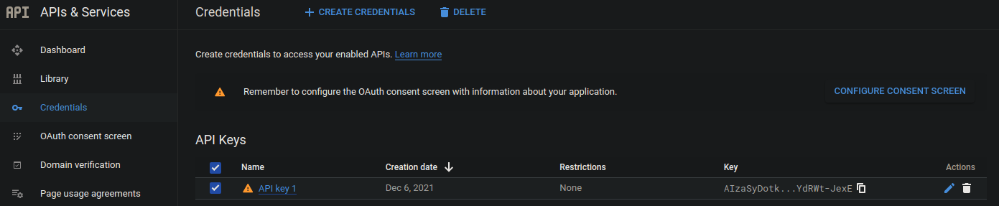
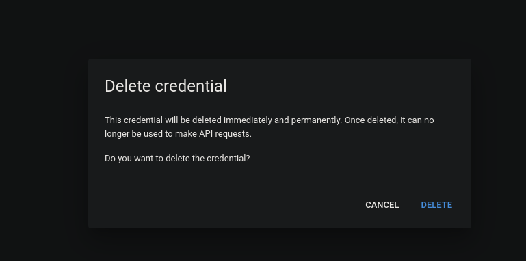
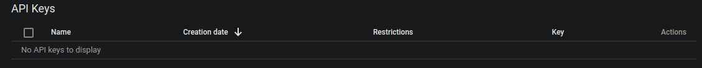

# Deleting A YouTube API Key

## Go To Your Dev Console

[Click here to go to the dev console.](https://console.developers.google.com/)

## Click On The Credentials Link On The Left.

## Check The Box To The Left Of Your Api Key

## Click The Trash Icon To The Right

## Confirm That You Want To Delete It

## You Should No Longer See The Api Key In Your Project

